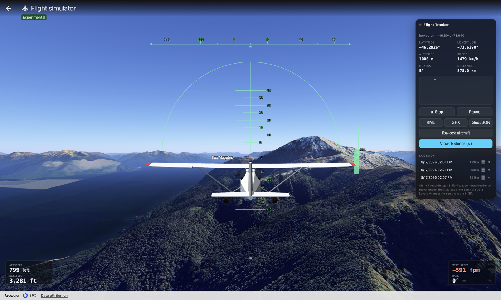
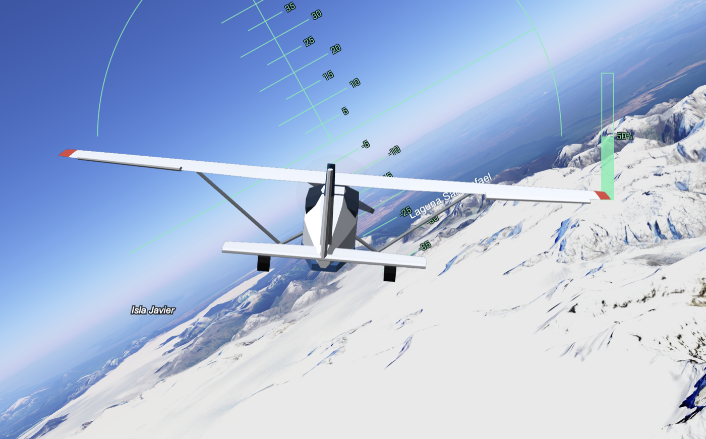
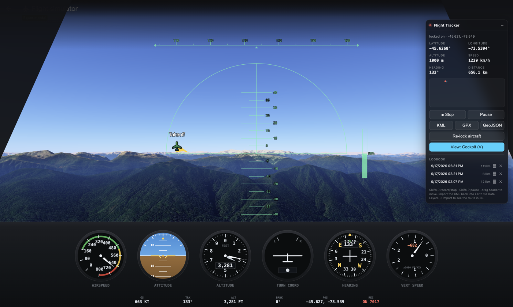
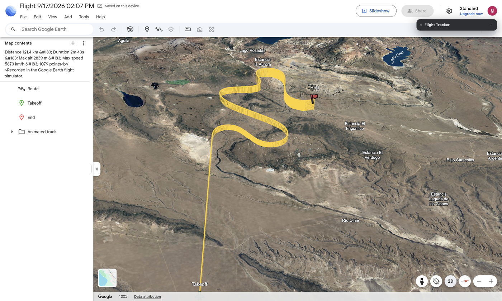
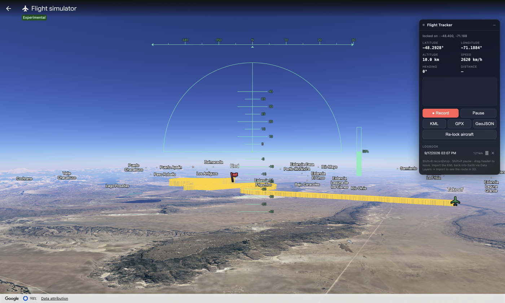

# Google Earth Flight Tracker

Adds a real aircraft, an MSFS-style glass panel and route recording to the
**Google Earth web flight simulator**.

Google Earth's flight simulator (shipped on the web in June 2026) gives you a wireframe
HUD, no aircraft, no instruments and no flight log. This adds all four.



## What it does

**Flies like a sim.** A low-poly aircraft rendered in a transparent WebGL overlay, sitting
in a chase camera that lags behind the aircraft's real attitude the way MSFS's does.
Ailerons, elevator and rudder deflect with the actual control inputs. The prop spins.



**Gives you a panel.** A six-pack glass cockpit - airspeed, attitude, altimeter, turn
coordinator, HSI, vertical speed - all driven by the true 6-DOF state, plus a windscreen
frame. The airspeed and vertical-speed dials pick their own range, because Earth's
simulator is quite happy to do 1,500 knots.



**Records where you went.** Every flight is logged and exportable as KML / GPX / GeoJSON.
Import the KML back into Earth and your route is drawn in 3D at true altitude, with
takeoff and end markers and an animated playback track.



The imported layer stays visible inside the simulator, so you can fly along an old route:



## Why this is not trivial

The simulator deliberately exposes nothing:

- the URL **freezes** the moment you enter the sim and never updates again
- the HUD is painted into a `<canvas>`, so there is no DOM readout
- there is no JS API, no `postMessage` traffic, and no accessible camera object
- all 3D tile requests happen inside web workers, invisible to the page

So this reads the aircraft state out of the engine itself.

Google Earth web runs its C++ engine as **multi-threaded WebAssembly on a
`SharedArrayBuffer`**, and that heap is reachable from the main thread. The camera state
lives in it as seven consecutive `float64`s:

```
[ lon, lat, altitude_m, heading, tilt, roll, fov ]
```

which is a full 6-DOF aircraft state - `pitch = tilt - 90`, and `roll` is the real bank
angle - so the instruments and the model are driven by the same numbers the engine flies.

The extension:

1. **Gets a handle on the WASM heap.** Emscripten hands WebGL views onto its own linear
   memory, so wrapping `bufferData` / `texImage2D` for a moment yields the engine's
   512 MB `SharedArrayBuffer`.
2. **Finds the camera struct** with a three-pass scan over ~67M doubles (~200 ms):
   plausible field ranges, then values that actually change between samples, then values
   that change *smoothly, at a plausible flight speed*. The engine keeps several identical
   copies; the winner is scored on copy count, tilt near the horizon, altitude and speed
   steadiness. Decoys (scratch values near lat/lon 0, scene-graph nodes, erratic jumpers)
   are filtered out.
3. **Polls that offset at ~7 Hz**, publishes it as `window.GEFT`, and records a track point
   whenever you move 20 m, turn 4 degrees, or every 2 s, whichever comes first.

Verified against Earth's own coordinate status bar - matches to the fourth decimal.
A 121 km recorded track measured 121.62 km when Google Earth re-imported the exported KML,
against 121.4 km computed locally.

Because Earth's camera already rolls and pitches with the aircraft, the exterior view
draws the model rigid in the frame and lets the world move behind it - which is exactly
what an external chase camera looks like. Only the lag between the true attitude and the
camera's smoothed attitude is applied to the model, so it banks into turns and settles
afterwards.

## Install

No build step, no dependencies, no network calls.

1. Clone or download this repo
2. Open `chrome://extensions`
3. Enable **Developer mode** (top right)
4. **Load unpacked** and select the repo folder
5. Reload `earth.google.com`

Chrome 111+ (the content scripts run in the `MAIN` world).

## Use

1. Google Earth, then **Tools > Flight simulator**
2. Start flying. The panel locks onto the aircraft within a few seconds
   (`locked on - lat, lon`)
3. **Record**, fly, **Stop**. The flight lands in the Logbook.

| Control | Action |
| --- | --- |
| `V` | cycle view: exterior, cockpit, off |
| `Shift + R` | start / stop recording |
| `Shift + P` | pause / resume |
| drag header | move the panel |
| `-` | collapse the panel |
| **Re-lock aircraft** | re-find the aircraft if the readout looks wrong |

Earth's own green HUD stays on top of everything; there is no way to hide it from outside
the canvas, so the cockpit panel and exterior readouts are laid out around it.

## Seeing a route in 3D

Export **KML**, then in Google Earth: **File > Open local KML file** (`Cmd+I` / `Ctrl+I`).

You get the route at true altitude extruded to the terrain, takeoff and end placemarks,
and a `gx:Track` with timestamps so Earth can play the flight back.

`examples/demo-flight.kml` is a real 121 km recording over Patagonia if you want to look at
the output format first. GPX works in Strava, Garmin and gpx.studio; GeoJSON works anywhere.

## Files

| | |
| --- | --- |
| `tracker.js` | heap access, camera lock, track recording, exports, the panel |
| `sim.js` | WebGL aircraft, chase camera, glass cockpit instruments |

## Details

- Crashes and "Restart" jumps are detected and split the track into separate legs instead
  of drawing a straight line across the map.
- Recordings survive a page reload (`localStorage`) and resume automatically.
- Everything stays local. Nothing is uploaded, no analytics.
- Reading another program's memory layout is inherently brittle. If a future Earth build
  moves things around, hit **Re-lock aircraft**; if that still fails, the heuristic in
  `lockCamera()` in `tracker.js` is the thing to adjust.

## Licence

MIT
