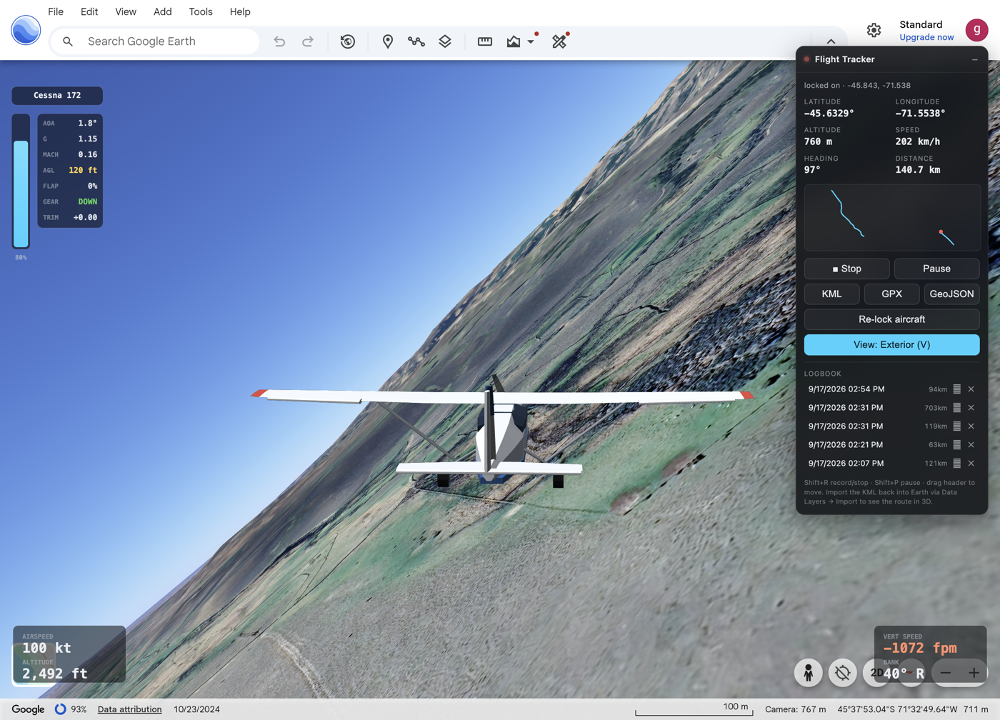
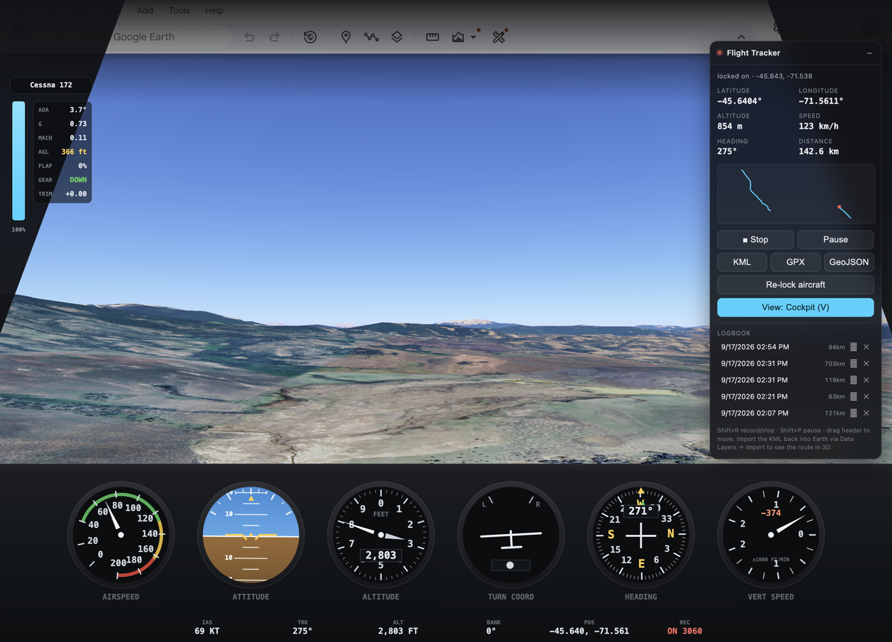

# Flight Simulator for Google Earth

Replaces Google Earth's flight simulator with a real one.

Earth's own simulator has no aerodynamics, no mass, no stall and no instruments, and it
cruises a light aircraft at 1,500 knots. This turns off Earth's physics entirely, flies the
camera with a proper stability-derivative flight model, draws the aircraft and a glass
cockpit, and records every route for export.



## What it actually does

**A real flight model.** Conventional rigid-body simulation: body-axis velocities and rates,
Euler attitude, `CL(α)` with a genuine stall break, induced and parasite drag, roll/pitch/yaw
moments from control surfaces plus damping and static stability (dihedral effect,
weathercock, adverse yaw). ISA atmosphere, so density altitude, service ceiling, IAS vs TAS
and Mach all fall out of the model instead of being faked. Integrated at a fixed 200 Hz with
control laws at 50 Hz, so the handling does not change with frame rate.

Let go of the stick and it flies a textbook phugoid. Hold the stick back and it stalls, the
lift curve breaks, a wing drops and it mushes into a descent until you unload it.

**Five aircraft**, each with its own mass, inertia, wing and coefficient set: Cessna 172,
Extra 300, jet airliner, glider, and a hypersonic one for when you want to cross an ocean.
Propeller thrust falls off with airspeed, turbofan thrust falls off with density.

**A cockpit.** Six-pack glass panel - airspeed, attitude, altimeter, turn coordinator, HSI,
vertical speed - plus throttle, flaps, gear, angle of attack, load factor, Mach and AGL.
The speed and vertical-speed dials pick their own range.



**An autopilot** with heading, altitude and speed hold, cascaded and authority-limited, plus
a wings-level recovery key for when it all goes wrong.

**Route recording.** Every flight is logged and exportable as KML, GPX or GeoJSON. Open the
KML back in Earth and the route is drawn in 3D at true altitude with an animated playback
track.


## Controls

| | |
| --- | --- |
| `↑` `↓` or `S` `W` | pitch |
| `←` `→` or `A` `D` | roll |
| `Q` `E` | rudder |
| `PgUp` `PgDn` or `+` `-` | throttle |
| `,` `.` | elevator trim |
| `F` / `Shift+F` | flaps down / up |
| `G` | landing gear |
| `B` | wheel brakes |
| `L` | wings level (hold) |
| `1` `2` `3` | autopilot heading / altitude / speed hold |
| `0` | autopilot off |
| `T` / `Shift+T` | next / previous aircraft |
| `R` | reset |
| `K` | terrain collision on/off |
| `M` | hand control back to Google Earth |
| `V` | view: exterior, cockpit, off |
| `Shift+R` / `Shift+P` | start-stop / pause recording |

A **gamepad or joystick** is picked up automatically: stick for pitch and roll, twist or
third axis for rudder, and a throttle axis if the device has one.

## How it works

Earth's flight simulator exposes nothing: the URL freezes the moment you enter it, the HUD is
painted into a `<canvas>`, there is no JS API or `postMessage` traffic, and all 3D tile
requests happen inside web workers.

But Earth web runs its C++ engine as **multi-threaded WebAssembly on a `SharedArrayBuffer`**,
and that heap is reachable from the main thread. The camera state lives in it as seven
consecutive `float64`s:

```
[ lon, lat, altitude_m, heading, tilt, roll, fov ]
```

That is a full 6-DOF aircraft state, and crucially it is **writable**. So the extension:

1. **Gets a handle on the WASM heap.** Emscripten hands WebGL views onto its own linear
   memory, so wrapping `bufferData` / `texImage2D` yields the engine's 512 MB
   `SharedArrayBuffer`.
2. **Finds the camera struct.** Either by matching the lat/lon Earth publishes in its own
   URL, or with a three-pass scan over ~67M doubles: plausible field ranges, then values that
   change between samples, then values that change smoothly at a plausible flight speed.
   Several identical copies exist and all of them get written.
3. **Flies it.** The flight model integrates and writes the camera every physics tick and
   every animation frame. Earth becomes purely a renderer.
4. **Reads the terrain.** Earth reports the ground elevation under the mouse to its
   accessibility tree, and re-picks it on any `PointerEvent`. A synthetic pointer sweeps the
   lower screen, and each reading arrives tagged with its own lat/lon, building a local
   elevation cache along the flight path.

Verified against Earth's own status bar: position matches to the fourth decimal, and a 121 km
recorded track measured 121.62 km when Earth re-imported the exported KML against 121.4 km
computed locally.

## Install

No build step, no dependencies, no network calls.

1. Clone or download this repo
2. Open `chrome://extensions`, enable **Developer mode**
3. **Load unpacked**, select the repo folder
4. Reload `earth.google.com`

Chrome 111+ (content scripts run in the `MAIN` world).

Then: open Google Earth, fly to somewhere interesting, and press **`M`**. You do not need
Earth's own flight simulator - the model takes over the normal Earth camera, which also means
none of Earth's green HUD is in the way. Press `M` again to hand the camera back.

## Honest limitations

- **Terrain height is an estimate.** It is screen-picked from Earth's own readout, so it is a
  sparse sample set interpolated along your path, not a height map. AGL and the ground
  proximity warnings are always live and advisory; actual terrain *collision* is off by
  default and toggled with `K`, because one bad sample should never be able to fly you into a
  mountain.
- Ground handling is simplified - there is rolling friction, braking, nosewheel steering and
  a liftoff that happens when lift exceeds weight, but no suspension model.
- The model is a stability-derivative simulation, not a CFD one. It will not teach you to fly
  a real aeroplane.
- Reading another program's memory layout is inherently brittle. If a future Earth build
  moves things, hit **Re-lock aircraft**; if that fails, `lockCamera()` in `tracker.js` is the
  thing to adjust.

## Files

| | |
| --- | --- |
| `tracker.js` | heap access, camera lock and write, route recording, exports, panel |
| `flight.js` | atmosphere, aerodynamics, engines, autopilot, input, terrain probe |
| `sim.js` | WebGL aircraft, chase camera, glass cockpit instruments |

Everything stays local. No network requests, no analytics, and the extension requests no
Chrome permissions at all.

## Licence

MIT
